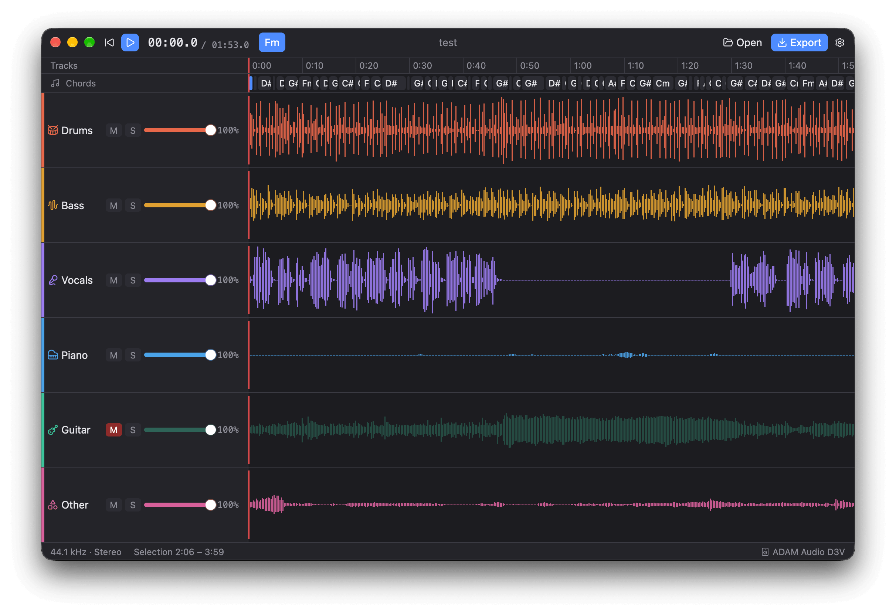

<p align="center">
  
</p>

<h1 align="center">Stemcraft</h1>

<p align="center">
  <a href="README.md">English</a> · <a href="README.zh-CN.md">简体中文</a> · <b>繁體中文</b>
</p>

將一首歌分離成六條音軌：鼓、貝斯、人聲、鋼琴、其他、吉他，再挑出想要的幾條，匯出成新的混音。
靈感來自 [Haig012/guitar-extractor](https://github.com/Haig012/guitar-extractor)，以 Rust 重寫。

專案包含命令列工具與 macOS 桌面 App。桌面 App 可以分離整首歌或其中一段，邊聽邊對六條音軌進行靜音、獨奏與音量調整，
再匯出混音（也可以同時匯出各條單軌與和弦譜），格式可選 WAV、FLAC、MP3、M4A（AAC）或 OGG。

分離使用 Demucs `htdemucs_6s` 模型，透過 [demucs-rs](https://github.com/nikhilunni/demucs-rs) /
[Burn](https://burn.dev) 在 GPU（Metal）上執行，不需要 Python、PyTorch 或 ffmpeg。
GPUI（[gpui-kit](https://github.com/longbridge/gpui-kit)）桌面 App 與命令列工具共用同一個核心函式庫。



## 目錄結構

| 路徑 | 內容 |
|---|---|
| `crates/core` | 核心函式庫：解碼（Symphonia）、分離、吉他 / 伴奏混音、和弦辨識、模型權重快取 |
| `crates/cli` | `stemcraft` 命令列工具 |
| `crates/app` | `stemcraft-app` 桌面 App（GPUI） |
| `misc/python_src` | 早期的 Python 原型（demucs-mlx），保留作為參考 |

## 建置

需要 Rust 1.98.1（已在 `rust-toolchain.toml` 中固定，rustup 會自動安裝）。

```bash
cargo build --release
```

## 桌面 App

```bash
cargo run --release -p stemcraft-app      # 從原始碼執行
script/bundle-macos.sh                    # → dist/Stemcraft.app 與 dist/Stemcraft.dmg
```

打包好的 App 把模型權重放在 `Contents/Resources/` 裡，離線即可使用，不需要另外安裝任何東西。
App 只做了 ad-hoc 簽署，所以在其他 Mac 上第一次開啟會被阻擋：開啟「系統設定 → 隱私權與安全性」，按一下「強制打開」即可
（macOS 15 之前的版本也可以按右鍵選「打開」）。若要發佈給他人，需要 Developer ID 簽署與公證。

設定（Stemcraft → 設定…，⌘,）包括：語言（English、简体中文、繁體中文，預設跟隨系統）、外觀（跟隨系統 / 淺色 / 深色）、
匯出位置與匯出預設值、音訊輸出裝置、GPU 最佳化快取，以及第三方授權。設定儲存在
`~/Library/Application Support/Stemcraft/settings.json`。

## 命令列用法

```bash
stemcraft song.mp3                 # → output/song/song_guitar.wav、song_no_guitar.wav
stemcraft song.mp3 --chords        # 另外輸出 song_chords.lrc / .txt
stemcraft song.mp3 -r 1:30-3:00    # 只處理歌曲的一段
stemcraft song.mp3 --all-stems     # 另外將六條原始音軌輸出到 output/song/stems/
```

（也可以使用 `cargo run --release -- song.mp3 …`。）支援的輸入格式：WAV、AIFF、FLAC、MP3、OGG Vorbis、
M4A（AAC/ALAC），單聲道或立體聲。輸出為 32 位元浮點 WAV，取樣率與輸入相同，因此疊加出的伴奏軌不會削波。

第一次執行會從 Hugging Face 下載模型權重（約 55 MB）到 `~/Library/Caches/demucs-rs/`，
並編譯、自動調校 GPU 核心（快取於 `~/Library/Application Support/autotune/`）；之後的執行會立即開始。

## 測試

```bash
cargo test
```
